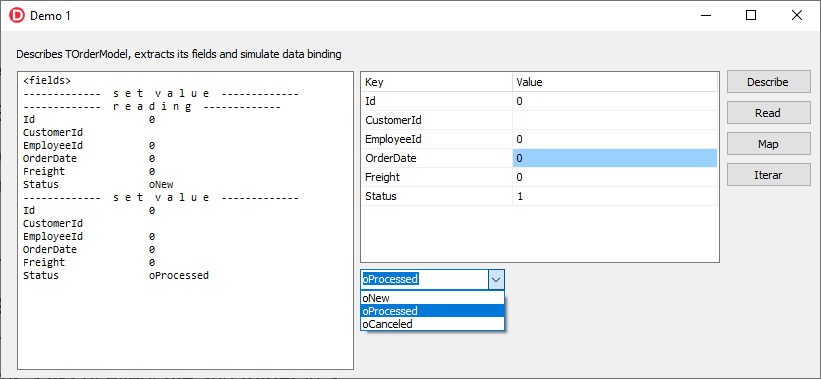

# RttiInterceptor

TRttiInterceptor is a single way to intercept Rtti Fields and Props.
It will iterate trought all fields and properties of any TObject, without creating rtti context.

/Samples has a small demonstration of the Interceptor Power.
In Sample1 we Map any TObject with many primitive type fields, using TValueListEditor as User Interface.

